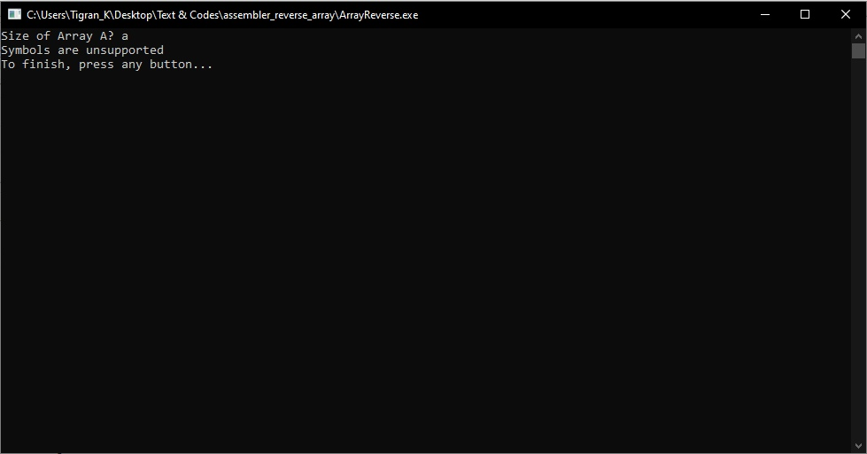

# Программа для ввода массива А и генерации массива B, который является массивом А в обратном порядке.
## Выполнил студент БПИ199 Кочарян Тигран Самвелович <tskocharyan@edu.hse.ru>.
---

## Описание работы программы:

* Пользователь вводит размер массива А. Если размер массива <= 0, программа выводит информацию о некорректном вводе и некорректный размер массива.

* Затем программа просит пользователя поэлементно ввести массив А.

* После ввода массива А, программа запускает генерацию массива B, который является массивом А в обратном порядке.

* Затем программа выводит массив А и массив B.
---

## Примеры работы кода:
#### Скриншот 1. Ввод размера 10. Ввод 10 чисел. Вывод массива А и массива B.

#### Скриншот 2. Ввод размера 0. Сообщение о некорректном вводе.

#### Скриншот 3. Ввод отрицательного размера на примере -1. Сообщение о некорректном вводе.

#### Скриншот 4. Ввод размера 5. Успешный ввод чисел и вывод массивов.

#### Скриншот 5. Ввод размера 10. Ввод 4 числа в качестве элементов и ввод символа (не числа) в качестве 5 элемента массива. Мгновенное завершение работы и сообщение об ошибке.

#### Скриншот 6. Ввод символа (не числа) в размер массива. Сообщение об ошибке.

#### Скриншот 7. Так как размер статического массива фиксированный и равен в данном случае 100, если пользователь при запросе ввода размера массива введет число >100, он получит сообщение об ошибки.

---
## [Контакты.](https://vk.com/k_tigran)
